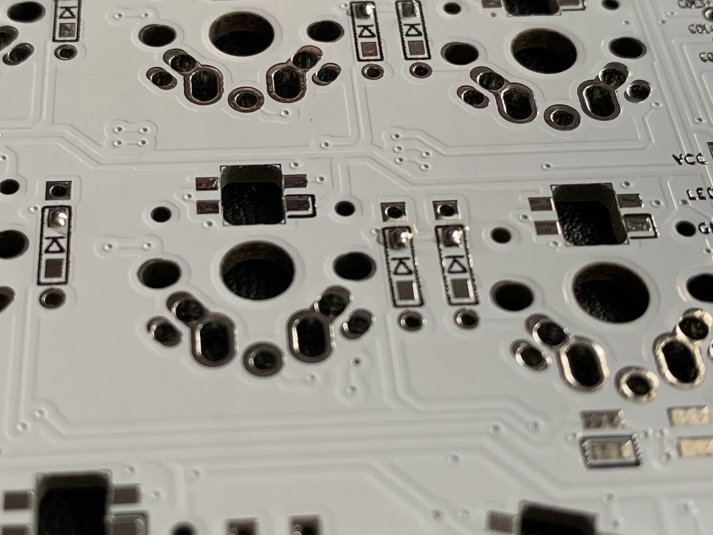

# Post - Soldering The Corne Keyboard

This weekend, I put together a new corne keyboard as I mentioned in
[[01b18013]].  I  have soldered only a total of 10 or 15 times, so I'm
definitely not an expert. Here are some tips I've picked up especially for
soldering surface mount components.

Basically, I soldered the surface mount diodes in 3 steps

## Prepare the pads
I start by putting a small amount of solder on each pad.

## Do the slide
Then I hold the component with some tweezers, heat up the solder I put on the
pad and "slide" the component into the solder.

## Solder the other side
Lastly, I come back and solder the other side of the component.

## The rest
The rest of the soldering on this board is pretty straight-forward. You put the
component through the hole and then heat both the hole and the component. Flow
solder into the tip of the soldering iron until you have good coverage on both
the component and the hole. It takes some practice but there is this moment
when you see the solder "snap" into place and create a minimal surface. At that
moment you want to remove the iron.

The switches are very similar, they just have very large holes to solder into,
so you have to flow quite a bit of solder before you get a solid connection.

Before you solder the switches, it might be worthwhile to bit a bit of
debugging[^debug] to ensure all the connections are good.

[^debug]: [[9f1bba7d]]
