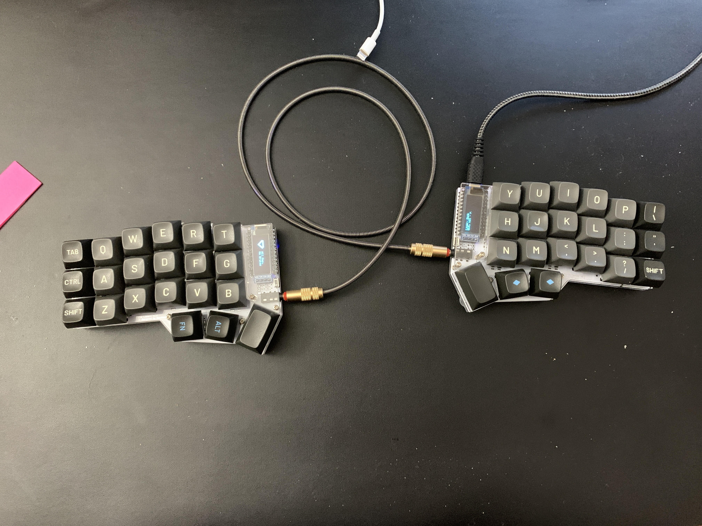

# Post - My keyboard!

I'm really into custom mechanical keyboards. I find they help me be more productive
since I actually enjoy typing on them. For the last year or so, I've
been rocking a [corne keyboard](https://github.com/foostan/crkbd)

I like the corne for a number of reasons. I like its split ergonomic design and
also I like how it only has 3 rows. My hands are not especially big and I find
it very convenient to reach every key[^layout] without having to move my hands.
Furthermore, using this keyboard for the past year has increased my
touch-typing ability which is important to me as a developer.

This build is specifically made of following components
* [Corne keyboard PCBs](https://keyhive.xyz/shop/corne-v3)
* [Gateron Brown Switches](https://mechanicalkeyboards.com/shop/index.php?l=product_detail&p=1640)
* [MT3 Susuwatari keycaps](https://drop.com/buy/drop-matt3o-mt3-susuwatari-custom-keycap-set)

Keyboard enthusiasts will know that I went pretty cheap on the switches, but
overall this is a great keyboard. I like it so much, that I'm going to make
a new one! So stay tuned!

[^layout]: You can check out my qmk layout on [github](https://github.com/DevonMorris/crkbd-devo)
