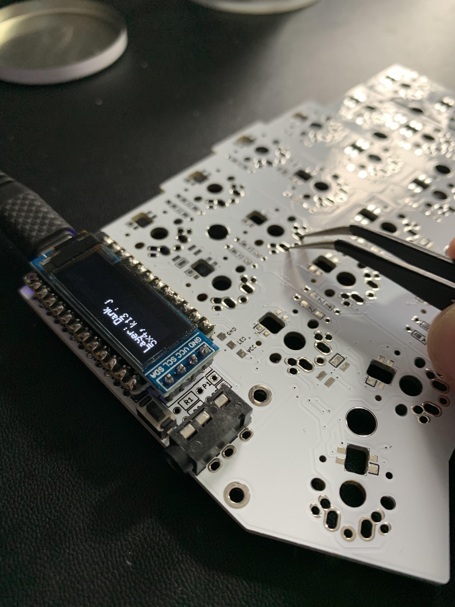

# Post - Debugging The Corne Keyboard

The debugging process for the corne keyboard is pretty easy, especially if you
install the oled modules. Basically you want to grab the
[qmk firmware](https://docs.qmk.fm/#/) and flash it on each board.

## Checking the diodes
Immediately after soldering a diode, you can check the connection with a
digital multimeter. The corne pcbs have a convenient traces to test each diode.
Basically just follow [this guide](https://www.fluke.com/en-us/learn/blog/digital-multimeters/how-to-test-diodes).


## Flashing the Firmware
In linux, this consists of putting your boards into dfu mode by holding the
reset button while connecting the keyboard. Then with the board in dfu mode,
you run one of the commands below (corresponding to which side).
```bash
sudo make crkbd:default:dfu-split-left
sudo make crkbd:default:dfu-split-right
```

## Checking The Firmware and the Board
Once the firmware has been flashed successfully and before the switches have
been soldered, you can test the diodes and the firmware by taking some tweezers
and shorting the connection the switches make.



If you have the OLED modules you'll see the character register on the screen.
If not, you can open a document and see if the letters appear when you make the
short. This is a super easy way to check the progress of the build, so I never
skip it.
