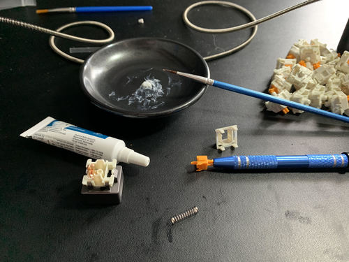
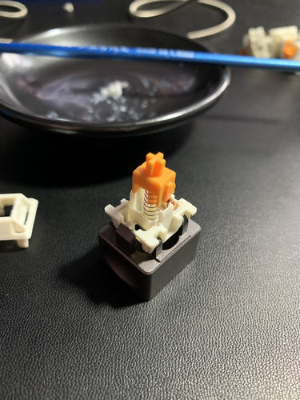

# Post - Glorious Lubing of Glorious Pandas

I'm in the process of building this new corne keyboard[^new] and I finally got
all the parts in the mail last week. As mentioned in my previous post, I
splurged and got the [Glorious Pandas](https://www.pcgamingrace.com/products/glorious-panda-mechanical-switches).
Everything I read points to these being some of the best tactile switches if
you lube them properly. So this is my experience with lubing the the glorious
pandas.

I should first mention that [this video](https://www.youtube.com/watch?v=44Wv4OGdmu4)
was super helpful in understanding how to lube switches. The main takeaway is
that "less is more" when it comes to lubing switches.

I tried a few different techniques but this is the process I found to me most
effective and streamlined.

Here is my basic setup. I've got my switch opener, a little plate for lube,
a thin brush and the switches. I put a small pea sized amount of lube on the
plate to remind me to no use too much.

For each switch, I perform the following steps
1. Open up the switch.
2. With a pin[^pin] size amount amount of lube, lube one end of the spring
3. Put the spring on the switch and lube the other end of the spring
4. Grab the stem of the switch with the 4 pronged grabber
5. Distribute a half-pin sized amount of lube between the two slotted sides of the stem
6. Brush the lube on all 4 sides of the stem avoiding the legs to maintain tactility
7. With the remaining lube on the brush, brush the inside of the steam where the spring connects
8. Reassemble and close the switch
9. Repeat!

These switches already felt smoother than the gateron browns before I did the
lubing process, but after lubing they incredible. I'm really pleased with how
they feel and am excited to put them on the PCB soon.

[^new]: [[01b18013]]
[^pin]: By pin, I mean the size of one of contacts on the bottom of the switch.
