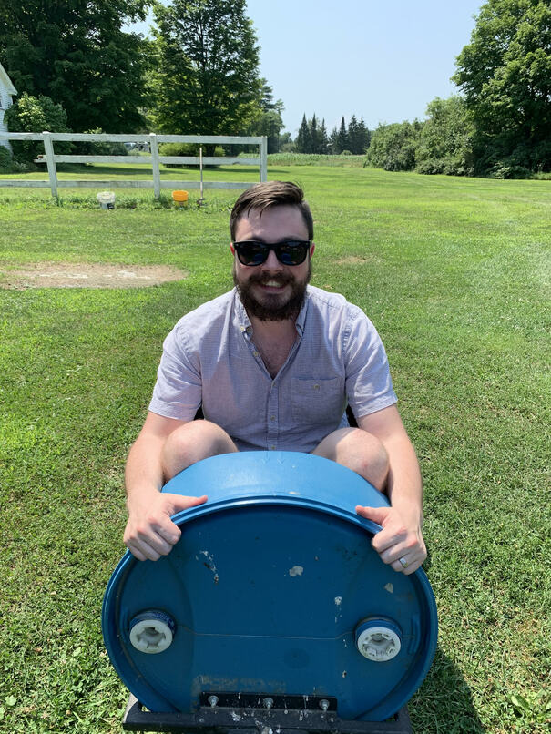

---
dirtree:
  display: False
---
# 👋🏼 I'm Devon Morris  👋🏼

## ✨ I'm a Dreamer
Sofware minimalism and craftmanship is my thing. I love linux, neovim and the
open-source movement. I strive for relentless improvement and efficiency in my
work and personal life. My goal is to create simple, generic, and
highly-flexible systems to solve the biggest problems in autonomy and robotics.

## 👨‍👩‍👦‍👦 I'm a family man

I am a husband to a wonderful wife and a father to two young boys. I love
spending time with my family and seeing the world through my kids' eyes.

## 🧠 I'm a thinker
Here are a few of my latest posts[^zet] in the form of a mini-blog. Basically this is
a place for me to conjecture, rant, reflect, inspect and pontificate.
[[z:zettels?tag=blog&limit=5&timeline]]

for my entire blog go to [[34bf05e7]]#

Here is [[f90d1158]]

## 🎮 I'm a hobbyist
Here are a few of my interests. I collect notes here as I learn more about these
topics.
[[z:zettels?tag=hub]]#

## 🦾 I'm an Engineer
You can find software that I make over at
[Github](https://github.com/DevonMorris).  Currently, I work for [Torc
Robotics](https://torc.ai/) as a perception engineer. Reach out on
[LinkedIn](https://www.linkedin.com/in/devonmorris1992/) if you want to connect
professionally and talk work. I'll keep this site free of most work related
topics.

[^zet]: For information on how this content is organized check out [[08c80e94]]
